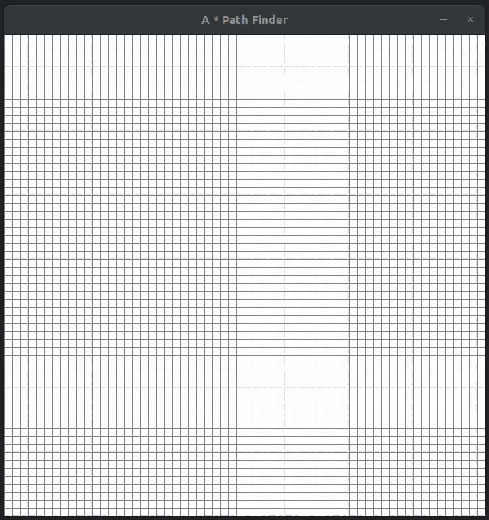

## A * Path Finding Visualizer

	  

This code is writen in Python and GUI is made using **PyGame**.

### Requirements
1. Python 3.x
2. PyGame - install using `pip install pygame`

### How To Visualize
1. Run `python main.py`  
2. When the window appears with the grid, **left click** on any one cell as start point.
3. **Left click** on any other cell as end point.
4. Now draw obstacles by holding left click and dragging the mouse.
5. Once the obstacles is created, press **SPACE** to start the visualizer.
6. To clear a specific cell, **right click** on the cell.
7. To clear the whole grid, press **C**.

